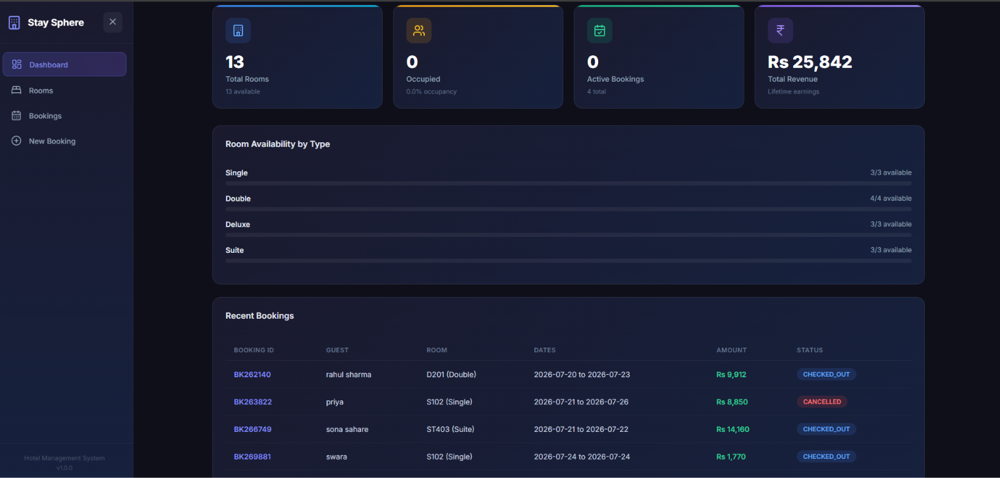
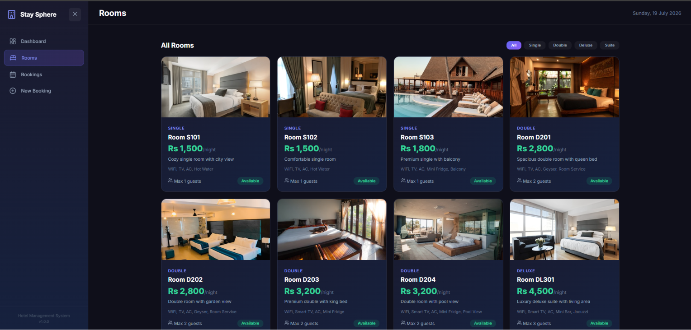
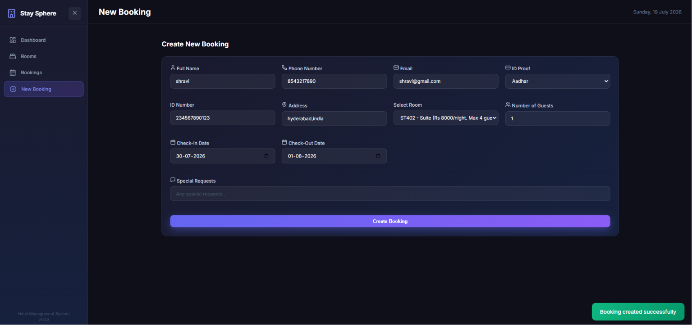
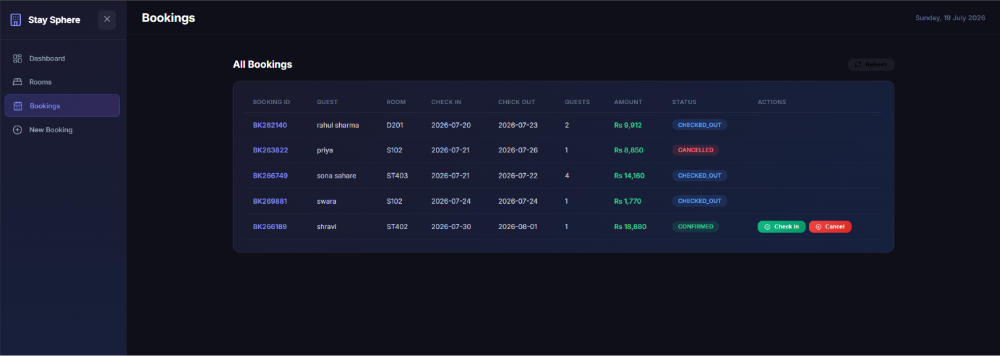
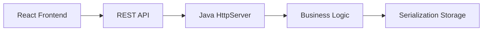

<p align="center">


</p>

<p align="center">


</p>

<h1 align="center">🏨 StaySphere</h1>

<p align="center">
A modern <b> Hotel Booking & Management System</b> built using <b>Java</b> and <b>React</b>. StaySphere simplifies hotel operations by managing rooms, guests, bookings, billing, occupancy analytics, and hotel revenue through a clean and responsive dashboard.
</p>

---

<p align="center">

### 🔗 Quick Navigation

<a href="#-overview">Overview</a> •
<a href="#-features">Features</a> •
<a href="#-screenshots">Screenshots</a> •
<a href="#-architecture">Architecture</a> •
<a href="#-tech-stack">Tech Stack</a> •
<a href="#-project-structure">Project Structure</a> •
<a href="#-api-endpoints">API</a> •
<a href="#-getting-started">Getting Started</a> •
<a href="#-future-enhancements">Roadmap</a> •
<a href="#-author">Author</a>

</p>

---

# 🚀 Overview

StaySphere is an enterprise-inspired hotel management platform that streamlines the complete booking lifecycle—from room availability and guest registration to check-in, check-out, GST billing, and real-time analytics.

The project demonstrates strong **Object-Oriented Programming**, **REST API development**, **state management**, and **frontend-backend integration** using a lightweight Java backend and a modern React interface.

---

# ✨ Features

✅ Live Dashboard

✅ Room Management

✅ Guest Registration

✅ Booking System

✅ Check-In & Check-Out

✅ Booking Cancellation

✅ GST Billing

✅ Revenue Analytics

✅ Occupancy Tracking

✅ Responsive UI

✅ Persistent Data Storage

---

# 📸 Screenshots

## Dashboard



---

## Rooms



---

## Create Booking



---

## Booking Management




# 🏗 Architecture



---

# 💻 Tech Stack

| Technology | Purpose |
|------------|----------|
| Java 17 | Backend |
| Java HttpServer | REST API |
| React 18 | Frontend |
| React Router | Navigation |
| Vite | Build Tool |
| CSS3 | Styling |
| Lucide Icons | Icons |
| Java Serialization | Persistent Storage |

---

# 📁 Project Structure

```
StaySphere/

├── backend/
│
├── frontend/
│
├── screenshots/
│
├── README.md
---

# ⚙️ Implementation

### Backend

- Object-Oriented Design
- Singleton Service
- RESTful API
- Java Serialization
- File Handling
- Business Logic Layer

### Frontend

- React Components
- React Router
- Responsive Dashboard
- Room Cards
- Booking Forms
- Statistics Panel

---

# 🔗 API Endpoints

| Method | Endpoint |
|----------|----------------------------|
| GET | /api/rooms |
| GET | /api/bookings |
| GET | /api/stats |
| POST | /api/bookings/create |
| POST | /api/bookings/checkin |
| POST | /api/bookings/checkout |
| POST | /api/bookings/cancel |

---

# 🚀 Getting Started

## Clone Repository

```bash
git clone https://github.com/shravanisahare14-web/staysphere-management-system.git
```

## Backend

```bash
cd backend

javac -encoding UTF-8 -d . src/model/*.java src/repository/*.java src/service/*.java src/api/*.java

java api.HotelApiServer
```

Backend runs on

```
http://localhost:8080
```

---

## Frontend

```bash
cd frontend

npm install

npm run dev
```

Frontend runs on

```
http://localhost:5173
```

---

# 🌟 Project Highlights

- Enterprise-inspired UI
- Complete Booking Lifecycle
- Java + React Full Stack
- Lightweight REST API
- Real-world GST Billing
- Dashboard Analytics
- Modular OOP Design
- Persistent Storage
- Responsive Layout

---

# 🚀 Future Enhancements

- 🔐 Authentication
- 🛢 MySQL Integration
- 💳 Payment Gateway
- 📧 Email Notifications
- 📱 Progressive Web App
- ☁️ Cloud Deployment
- 🐳 Docker Support

---

# 📚 Concepts Demonstrated

- Object-Oriented Programming
- Encapsulation
- Abstraction
- Singleton Pattern
- REST API Development
- CRUD Operations
- Java File Handling
- Java Serialization
- React Hooks
- Component Architecture
- Responsive Design

---

# 👨‍💻 Author

**Shravani Sahare**

B.Tech Electronics & Communication Engineering

Java • React • Full Stack Development

⭐ If you found this project helpful, consider giving it a **Star**!

---

<p align="center">

Made with ❤️ using Java & React

</p>
